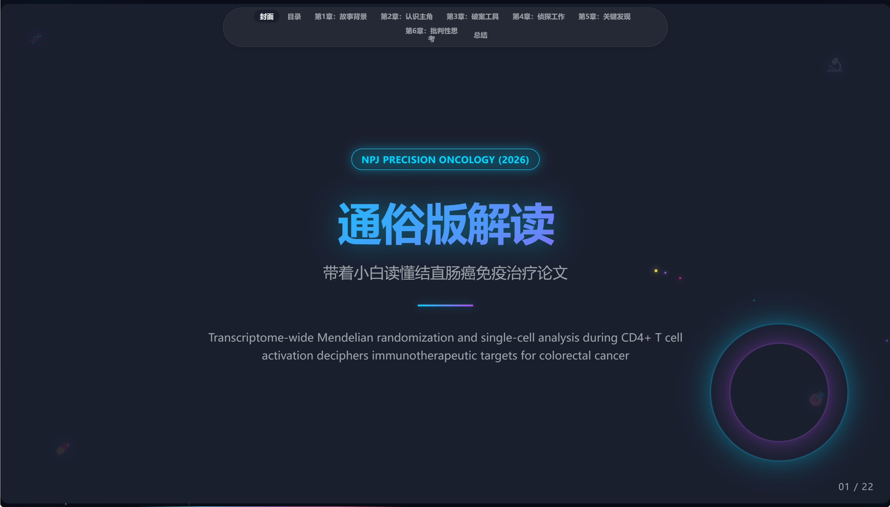
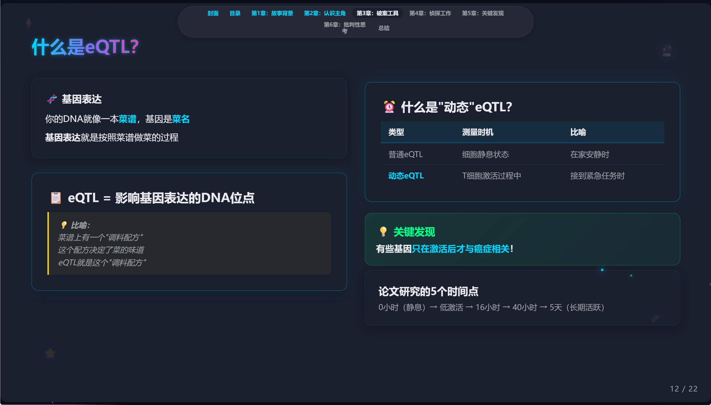
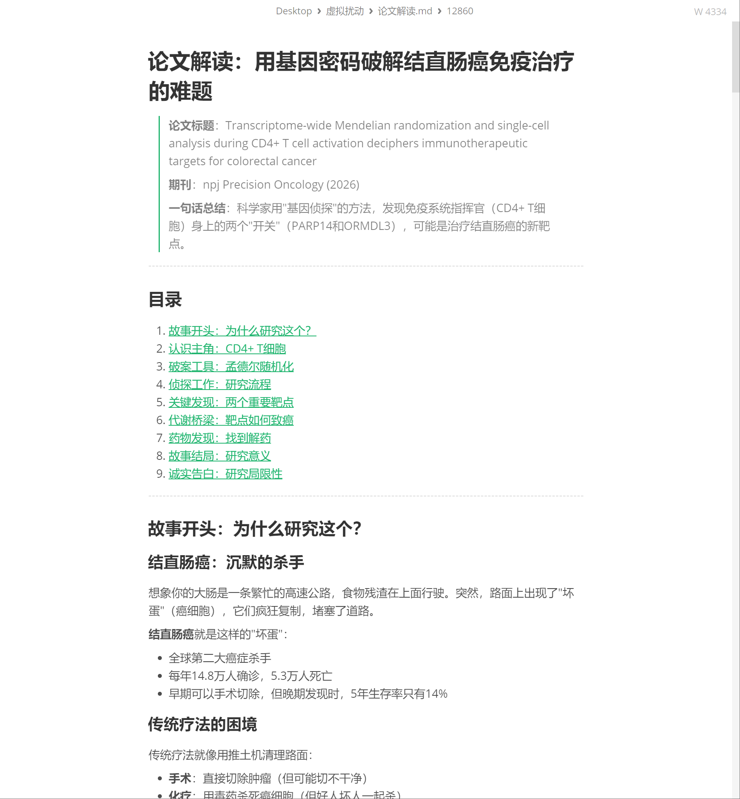
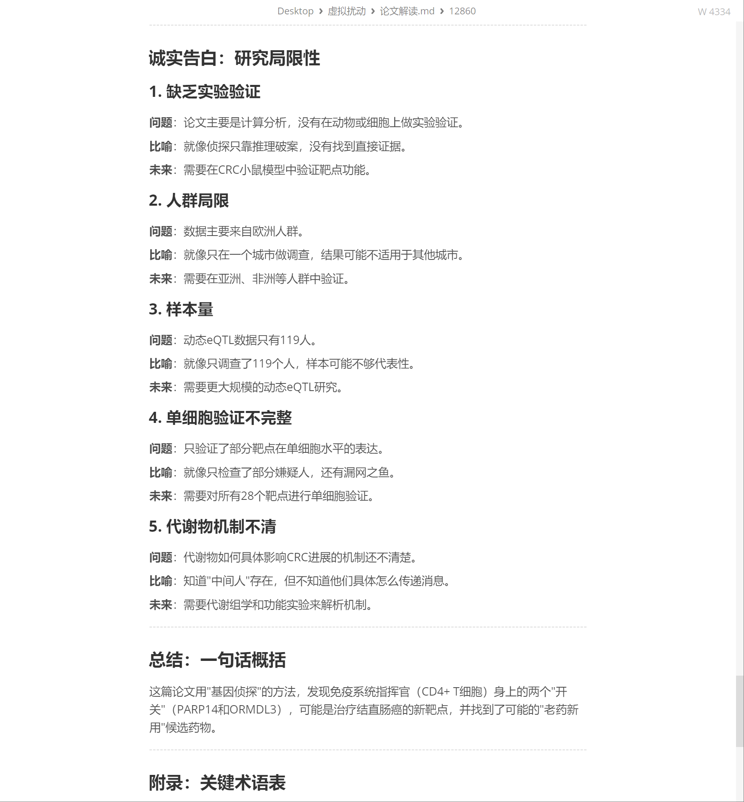
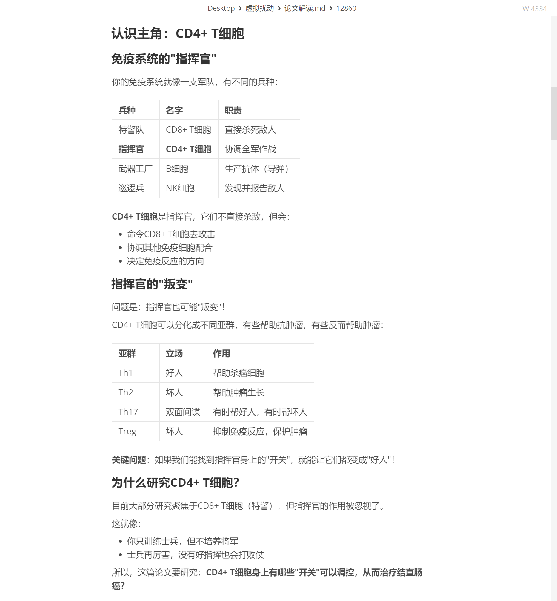
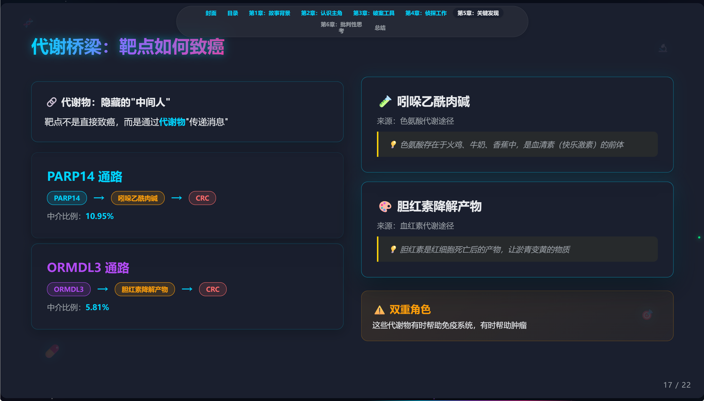

# Paper Reader — 通俗读论文 Claude Code Skill

<p align="center">
  <a href="https://github.com/chenyangji666/paper-reader/blob/main/LICENSE"></a>
  <a href="https://claude.ai/code"></a>
  
  
  
</p>

> 用场景化、比喻化的方式，带领你一步步读懂学术论文，让小白也能理解专业内容。

<p align="center">
  
</p>

---

## 一句话介绍

把枯燥的论文变成生动的故事——用生活比喻解释专业概念，六章带你从零读懂任何学术论文。

---

## 效果展示

<table>
  <tr>
    <td></td>
    <td></td>
  </tr>
  <tr>
    <td></td>
    <td></td>
  </tr>
</table>

<p align="center">
  
</p>

---

## 核心特性

- **场景化比喻** — 用生活场景解释专业概念（免疫系统=军队，CD4+ T细胞=指挥官）
- **循序渐进** — 从背景到方法到发现，六章逐步深入
- **互动确认** — 每章结束后确认理解，确保跟上节奏
- **通俗语言** — 避免专业术语，全程大白话
- **自动输出** — 每讲完一章自动更新 Markdown 文件，生成完整解读文档

---

## 安装

### 方式一：手动安装

将 `SKILL.md` 复制到你的 Claude Code skills 目录：

```bash
mkdir -p ~/.claude/skills/paper-reader
cp SKILL.md ~/.claude/skills/paper-reader/
```

Windows 用户：
```
将 SKILL.md 复制到 C:\Users\<你的用户名>\.claude\skills\paper-reader\
```

### 方式二：克隆安装

```bash
git clone https://github.com/chenyangji666/paper-reader.git
mkdir -p ~/.claude/skills/
cp -r paper-reader ~/.claude/skills/paper-reader
```

---

## 使用方法

在 Claude Code 中直接说：

```
帮我读这篇论文
```

或者：

```
读论文 /path/to/paper.pdf
```

Claude 会自动：

1. **读取论文** — 支持 PDF 格式，自动渲染或提取文本
2. **了解你的背景** — 询问专业基础、学习方式、深入程度
3. **设计学习方案** — 根据背景定制六章讲解计划
4. **逐章讲解** — 用场景比喻带你理解每个概念
5. **生成文档** — 输出完整的通俗版解读 Markdown

---

## 六章学习体系

| 章节 | 标题 | 核心问题 | 比喻 |
|:----:|------|----------|------|
| 1 | 故事背景 | 为什么研究这个？ | 电影开场 |
| 2 | 认识主角 | 研究对象是什么？ | 介绍人物 |
| 3 | 破案工具 | 用什么方法研究？ | 侦探道具 |
| 4 | 侦探工作 | 具体怎么做的？ | 破案过程 |
| 5 | 关键发现 | 发现了什么？ | 真相大白 |
| 6 | 批判性思考 | 有什么局限？ | 复盘反思 |

---

## 内置比喻库

### 生物学概念

| 概念 | 比喻 |
|------|------|
| 免疫系统 | 国家军队 |
| CD4+ T 细胞 | 指挥官 |
| CD8+ T 细胞 | 特警 |
| B 细胞 | 武器工厂 |
| NK 细胞 | 巡逻兵 |
| Th1 | 主战派将军 |
| Th2 | 投降派将军 |
| Treg | 内奸 |
| 肿瘤微环境 | 战场环境 |

### 方法学概念

| 概念 | 比喻 |
|------|------|
| 孟德尔随机化 | 用基因做"自然实验" |
| SNP | DNA 上的单个字母变异 |
| scRNA-seq | 看每个士兵的状态 |
| GWAS | 全基因组关联研究 |

### 药物发现概念

| 概念 | 比喻 |
|------|------|
| 分子对接 | 钥匙和锁 |
| 结合能 | 钥匙插入的紧密程度 |
| 老药新用 | 用现有的药治新病 |

---

## 适配场景

- 生物医学论文（肿瘤学、免疫学、基因组学等）
- 方法学论文（孟德尔随机化、scRNA-seq、GWAS 等）
- 药物发现论文（分子对接、CMap 等）
- 其他领域的论文（会自动适配比喻库）

---

## 搭配 HTML PPT Skill —— 从读懂论文到汇报论文

读完论文还不够？搭配 [HTML PPT Skill](https://github.com/chenyangji666/html-ppt-skill)，可以一键把通俗解读变成**苹果发布会级别的演示文稿**，直接用于组会汇报、学术交流。

**工作流程：**

```
论文 PDF
  │
  ▼
┌─────────────┐
│ paper-reader │  用生活比喻读懂论文，输出通俗版解读.md
└──────┬──────┘
       │
       ▼
┌──────────────────┐
│ html-ppt-skill   │  将解读内容转为高信息密度的 HTML 演示文稿
└──────┬───────────┘
       │
       ▼
  浏览器打开即可汇报
  （支持动画、图表、代码高亮、暗色/亮色主题）
```

**使用方式：**

```
# 第一步：读论文
帮我读这篇论文 /path/to/paper.pdf

# 第二步：用解读内容做 PPT
用 html-ppt-skill 把刚才的通俗版解读做成汇报 PPT
```

**效果：** 从一篇陌生的论文到一份可以直接汇报的演示文稿，全程不超过 10 分钟。

---

## 输出示例

讲解完成后，会在论文目录下生成 `通俗版解读.md`：

```
论文目录/
├── 论文原文.pdf
└── 通俗版解读.md   <-- 自动生成
```

文件包含：
- 论文基本信息（标题、期刊、一句话总结）
- 六章完整解读（带场景比喻）
- 关键术语表
- 学习检验清单

---

## 依赖

- [Claude Code](https://claude.ai/code) — Anthropic 官方 CLI 工具
- `poppler-utils`（可选）— 用于 PDF 渲染为图片
- `PyPDF2`（可选）— 用于 Python 提取 PDF 文本

---

## 许可证

[MIT License](LICENSE)

---

<p align="center">
  <sub>Made with ❤️ by <a href="https://github.com/chenyangji666">chenyangji666</a></sub>
</p>
